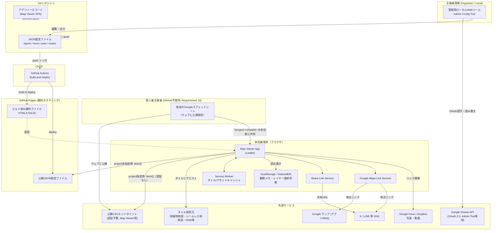

# Design Document

## Overview
本システムは、地理学・地質学の野外教育を支援するスマートフォン向けWebGIS（Leafletベース）であり、Phase 1ではサーバーを持たないGitHub Pages上の静的SPA（Single Page Application）として構築する。レイヤー構成・見学ポイント（POI）・巡検ルート・メディアリンクはリポジトリ内のJSON設定ファイルとして管理し、主催者はローカルの管理用Webツールでこれらを編集してGitにコミット・プッシュすることでサイトへ反映する。GNSS位置表示、オフラインタイルキャッシュ、URL共有、Googleマップ連携リンクなど、参加者側の機能はすべてクライアントサイド（ブラウザ）で完結させ、外部サービス（タイル配信元、Google Drive/Dropbox、Googleマップ、X/LINE）とは疎結合な連携（リンク遷移・fetch）のみを行う。

Requirement 15・16により、GitHubを使わない第三者の主催者も本アプリを流用できる。主催者はGoogleスプレッドシート上でレイヤー・ツアーを編集し（Admin Config ToolからOAuth経由で読み書き）、スプレッドシートを「ウェブに公開」設定した上でそのIDをURLパラメータ（`?project=<spreadsheetId>`）として参加者に共有する。参加者向けMap Viewerはこのパラメータを検出すると、GitHubリポジトリのフォーク・デプロイなしに、認証情報を一切使わない公開CSV読み取りのみでそのプロジェクトを表示する。

Requirement 17により、Googleアカウントを使わない主催者向けに、Admin Config Toolはエクセルブック（`.xlsx`、複数シート構成）形式でのプロジェクトのダウンロード・アップロードにも対応する。Googleスプレッドシート（Requirement 15）と同一のシート構成・列定義を用いるため、変換ロジック（GoogleSheetsRowMapping）を再利用でき、Admin Config Tool専用の機能として参加者向けMap Viewerのバンドルには影響しない。

## Architecture

### High-Level Architecture


### System Components
- **Map Viewer App**: 参加者（学生）がスマートフォンブラウザで利用するメインのSPA。地図表示、GNSS現在地、レイヤー切替、POI/ルート表示、観察メモ、URL共有、Googleマップ連携を担う。`project`パラメータ指定時は、公開Googleスプレッドシートからの読み取り専用プロジェクト読み込み（Requirement 16）も行うが、認証情報は一切扱わない。
- **Admin Config Tool**: 主催者がレイヤー・POI・ルート・メディアリンクを編集するためのローカル実行Webツール（アプリ本体とは別バンドル）。編集結果はJSONファイルとして出力し、Git操作は主催者自身が行う。Googleスプレッドシートとの保存・読み込み（Requirement 15）、エクセルブック（`.xlsx`）のダウンロード・アップロード（Requirement 17）も本ツールにのみ実装する。
- **Config Repository (JSON)**: レイヤー定義・ツアー（実習）単位のPOI/ルート/メディアリンクを保持するバージョン管理対象のJSONファイル群。GitHub Pagesへ実際にデプロイされる正式形式。
- **Service Worker / Offline Cache**: 閲覧済みタイル・アプリアセットをキャッシュし、圏外時の閲覧継続を支える。
- **Build & Deploy Pipeline (GitHub Actions)**: push時に静的アセットをビルドし、GitHub Pagesへ自動デプロイする。
- **External Integrations**: 地図タイル配信元、Google Drive/Dropbox（メディアリンク）、Googleマップ（地点リンク）、Web Share API経由のSNS連携、Google Sheets API（Admin Config Toolのみ、OAuth 2.0経由でのプロジェクト編集用中間フォーマット、Requirement 15）。

## Components and Interfaces

### Core Interfaces
```typescript
interface LatLng {
  lat: number;
  lng: number;
}

type LayerType = "base" | "overlay";

interface LayerDefinition {
  id: string;                 // レイヤー一意識別子
  name: string;                // 表示名
  type: LayerType;
  urlTemplate: string;         // 例: "https://.../{z}/{x}/{y}.png"
  attribution: string;
  opacity: number;             // 0.0 - 1.0
  minZoom: number;
  maxZoom: number;
  defaultVisible: boolean;
}

type MediaType = "photo" | "video";

interface MediaLink {
  url: string;                 // Google Drive / Dropbox 共有リンク
  caption: string;             // 短い説明文
  type: MediaType;
}

interface ReferencePaper {
  url: string;                 // 公開論文PDFへの外部リンク（DOI/J-STAGE/リポジトリ等）
  citation: string;            // 論文タイトル・出典（著者/発行年等を含む短い引用表記）
}

interface PointOfInterest {
  id: string;
  name: string;
  description: string;         // 短い説明文
  position: LatLng;
  media: MediaLink[];          // Requirement 4.1（写真・動画）
  referencePapers: ReferencePaper[]; // Requirement 4.2（参考論文PDFリンク）
}

interface RoutePath {
  id: string;
  name: string;
  points: LatLng[];            // 線データの頂点列
}

interface TourConfig {
  id: string;                  // 実習（コース・回次）単位の識別子
  title: string;
  description?: string;
  layerIds: string[];          // layers.json 内のLayerDefinition.idを参照
  pois: PointOfInterest[];
  routes: RoutePath[];
}

interface ObservationMemo {
  id: string;
  position: LatLng;
  text: string;
  createdAt: string;           // ISO8601
  updatedAt: string;
}

interface ShareViewState {
  lat: number;
  lng: number;
  zoom: number;
  baseLayerId: string;
  overlayLayerIds: string[];
  poiId?: string;               // 開いていたPOI詳細パネル（任意）
  tourId?: string;              // 表示中だったツアー（任意、複数ツアー対応後に追加）
}

interface GoogleMapsLinkParams {
  lat: number;
  lng: number;
}
```

### MapViewer（ルートコンポーネント）
**Responsibilities:**
- Leaflet地図インスタンスの初期化と各サブサービスの統合
- URLクエリ/ハッシュからの初期表示状態（共有ビュー、ツアーID、`project`パラメータ含む）復元
- 複数ツアー間の切替（`listAvailableTours()`の一覧からの選択、選択に応じたPOI/ルート再描画とレイヤー構成の初期値提案）
- `project`パラメータが指定された場合、`PublicSheetProjectLoader`経由での第三者プロジェクトの読み込みへの切替（Requirement 16）
- 画面レイアウト（レイヤーコントロール、現在地ボタン、共有・ツアー切替・Googleマップボタン等）の配置

**Key Methods:**
- `initialize(container: HTMLElement): void`
- `applyShareState(state: ShareViewState): void`
- `getCurrentViewState(): ShareViewState`

実装上は上記の責務を単一クラスにまとめず、`src/main.ts`内の複数の`setupXxx()`関数（`setupLocationTracking`, `setupTourSwitching`, `setupShareControl`等）に分割している。

### ConfigLoader
**Responsibilities:**
- 実行時に `config/layers.json` および `config/tours/*.json` をfetchし、TourConfig/LayerDefinitionへパースする
- 取得したJSONのスキーマ検証（ConfigValidatorを利用）
- URLに`project`パラメータ（Requirement 16）が指定されている場合は、`PublicSheetProjectLoader`へ委譲する

**Key Methods:**
- `loadLayers(): Promise<LayerDefinition[]>`
- `loadTour(tourId: string): Promise<TourConfig>`
- `listAvailableTours(): Promise<{ id: string; title: string }[]>`

### ConfigValidator（共有ライブラリ：Admin Tool / Map Viewer 双方で利用）
**Responsibilities:**
- タイルURLテンプレートの形式検証（`{z}/{x}/{y}` プレースホルダの有無等、Requirement 11.4）
- メディアリンクURLの簡易検証（`http(s)://`始まりか、Requirement 4.1.6）
- 参考論文リンクURLの簡易検証（`http(s)://`始まりか、Requirement 4.2.6）
- JSONスキーマ全体の整合性チェック（必須フィールド欠落等）

**Key Methods:**
- `validateLayerDefinition(layer: LayerDefinition): ValidationResult`
- `validateMediaLink(link: MediaLink): ValidationResult`
- `validateReferencePaper(paper: ReferencePaper): ValidationResult`
- `validateTourConfig(tour: TourConfig): ValidationResult`

### LayerManager
**Responsibilities:**
- LayerDefinition一覧からLeafletタイルレイヤーを生成し、ベース/オーバーレイの切替を管理
- 現在の表示レイヤー構成をlocalStorageへ永続化し、再読み込み時に復元（Requirement 2.5）

**Key Methods:**
- `setBaseLayer(layerId: string): void`
- `toggleOverlay(layerId: string, visible: boolean): void`
- `getActiveLayerState(): { baseLayerId: string; overlayLayerIds: string[] }`

### GeolocationService
**Responsibilities:**
- Geolocation APIの`watchPosition`をラップし、現在地・測位精度・方位（DeviceOrientation）をMapViewerへ通知
- 許可拒否・取得失敗時のエラー通知

**Key Methods:**
- `startWatching(onUpdate, onError): void`
- `stopWatching(): void`
- `setFollowMode(enabled: boolean): void`

### OfflineCacheService
**Responsibilities:**
- Service Workerの登録・ライフサイクル管理
- 閲覧済みタイル/アプリアセットのキャッシュ、想定エリアの一括プリキャッシュ（Requirement 3.4）

**Key Methods:**
- `register(): Promise<void>`
- `precacheArea(bounds: LatLngBounds, zoomLevels: number[]): Promise<void>`
- `isTileCached(url: string): Promise<boolean>`

### POIRouteOverlay
**Responsibilities:**
- TourConfig内のPOI・ルートをLeafletマーカー/ポリラインとして描画
- POIタップ時に詳細パネル（名称・説明・メディアリンク一覧・参考論文一覧）を表示。写真/動画（media）と参考論文（referencePapers）は「メディア」「参考文献」のように別セクションで表示し区別する（Requirement 4.2.4）

**Key Methods:**
- `renderTour(tour: TourConfig): void`
- `openPoiDetail(poiId: string): void`
- `closePoiDetail(): void`

### ObservationMemoStore
**Responsibilities:**
- 観察メモのCRUDをlocalStorage/IndexedDBに対して行う（Requirement 5.3）
- メモ一覧のCSV/GeoJSONエクスポート

**Key Methods:**
- `add(memo: Omit<ObservationMemo, "id" | "createdAt" | "updatedAt">): ObservationMemo`
- `update(id: string, text: string): void`
- `delete(id: string): void`
- `list(): ObservationMemo[]`
- `exportAsGeoJson(): string`
- `exportAsCsv(): string`

### ShareLinkService
**Responsibilities:**
- 現在のビュー状態（中心・ズーム・レイヤー構成・任意でPOI ID）をURLへエンコード／URLからデコード
- 不正・破損パラメータ検出時のフォールバック判定（Requirement 13.7）

**Key Methods:**
- `encode(state: ShareViewState): string`（URLを返す）
- `decode(url: string): ShareViewState | null`
- `copyToClipboard(url: string): Promise<boolean>`
- `shareViaWebShareApi(url: string): Promise<boolean>`

### GoogleMapsLinkService
**Responsibilities:**
- 任意地点の緯度経度からGoogleマップのピン留め形式URLを生成（Requirement 14.2）
- クリップボードコピー、非対応環境でのフォールバックUI表示

**Key Methods:**
- `buildSearchUrl(params: GoogleMapsLinkParams): string`
- `copyToClipboard(url: string): Promise<boolean>`

### AdminConfigTool（Layer/POI/Route Editor）
**Responsibilities:**
- レイヤー・POI・ルート・メディアリンクのフォーム編集、ConfigValidatorによる検証、地図プレビュー（Requirement 11.5）
- 編集結果のJSONファイル出力（ダウンロード）

**Key Methods（概念上のインターフェース）:**
- `loadExistingConfig(source: File | string): Promise<TourConfig | LayerDefinition[]>`
- `previewOnMap(config: TourConfig | LayerDefinition[]): void`
- `exportJson(config: TourConfig | LayerDefinition[]): Blob`

実装上は、単一の`AdminConfigTool`クラスではなく2つの独立したページ（`admin-tool/index.html`のレイヤー編集、`admin-tool/tour-editor.html`のツアー/POI/ルート編集）として構成し、それぞれ以下のコンポーネント・サービスに分解している。
- `AdminLayerListStore` / `AdminTourStore`: メモリ上でのCRUD管理（上記`loadExistingConfig`/`exportJson`に相当）
- `layerEditorForm` / `poiEditorForm` / `routeEditorForm` / `linkListEditor`: フォーム編集UI（`ConfigValidator`によるリアルタイム検証を含む）
- `layerListView` / `simpleListView`: 一覧表示UI
- 地図プレビューは各ページの`main.ts`（`admin-tool/src/main.ts`, `admin-tool/src/tourEditorMain.ts`）がLeafletインスタンスを直接操作して実現（上記`previewOnMap`に相当）
- `adminNav`: 2ページ間の移動用共有ナビゲーション

### GoogleSheetsRowMapping（共有ライブラリ：Admin Tool / Map Viewer 双方で利用）
**Responsibilities:**
- `LayerDefinition[]`・`TourConfig`（POI/メディア/参考文献/ルート/ルート頂点）と、スプレッドシートの複数シート（タブ）の行表現との相互変換。認証情報やネットワークI/Oを一切含まない純粋な変換ロジック
- `mergeTourIntoSheets`は対象`tour.id`の行のみを置換し、他ツアーの行は保持する（既存シートへの非破壊マージ）

認証・I/Oを伴わない純粋関数であるため、`ConfigValidator`同様Admin Config Tool（書き込み用）とMap Viewer（読み取り用、Requirement 16）の双方から利用する共有モジュールとして実装する。

**Key Functions:**
- `layersToSheet(layers): string[][]` / `sheetToLayers(rows): LayerDefinition[]`
- `mergeTourIntoSheets(existing, tour): SheetsData` / `extractTourFromSheets(sheets, tourId): TourConfig | null`

### GoogleSheetsProjectService（Requirement 15、Admin Config Tool専用）
**Responsibilities:**
- Google Identity Services（GIS）を用いたOAuth 2.0認可（アクセストークン取得）。主催者自身のGoogle CloudプロジェクトのOAuthクライアントIDを設定画面で入力し利用する
- Google Sheets API v4（REST、`fetch`による直接呼び出し）を用いた、指定スプレッドシートへの読み書き（GoogleSheetsRowMappingで変換）

**設計方針:**
- Google製の重量級クライアントライブラリ（`gapi`）は使わず、GIS（`https://accounts.google.com/gsi/client`をAdmin Toolページに動的読み込み）でトークンを取得し、以降は`fetch()`でSheets API RESTエンドポイントを直接呼び出す。新規npm依存を追加しない
- OAuthスコープは`https://www.googleapis.com/auth/spreadsheets`（読み書き）。主催者が指定した既存スプレッドシートIDを読み込む必要がある（Requirement 15.2）ため、作成元がアプリに限定される`drive.file`スコープでは要件を満たせないと判断した
- OAuthを用いた読み書きはAdmin Config Tool（ローカル実行）専用とし、参加者向けMap Viewerには一切組み込まない（Requirement 15.7）。OAuthクライアントID・トークンはAdmin Config Toolのブラウザメモリ/localStorageにのみ保持し、リポジトリにコミットしない

**Key Methods:**
- `authorize(clientId: string): Promise<boolean>`
- `isAuthorized(): boolean`
- `saveLayers(spreadsheetId: string, layers: LayerDefinition[]): Promise<void>`
- `loadLayers(spreadsheetId: string): Promise<LayerDefinition[]>`
- `saveTour(spreadsheetId: string, tour: TourConfig): Promise<void>`
- `loadTour(spreadsheetId: string, tourId: string): Promise<TourConfig>`

### PublicSheetProjectLoader（Requirement 16、Map Viewer専用）
**Responsibilities:**
- URLクエリパラメータ`project`にGoogleスプレッドシートIDが指定された場合、認証情報なしでそのスプレッドシートの内容（レイヤー・ツアー）を取得する
- 取得したCSVをパースし、GoogleSheetsRowMappingで`LayerDefinition[]`/`TourConfig`へ変換する

**設計方針:**
- OAuth・APIキーを一切使わない。スプレッドシートの「ウェブに公開」機能で得られる公開CSVエンドポイント（`https://docs.google.com/spreadsheets/d/{id}/gviz/tq?tqx=out:csv&sheet={シート名}`）を`fetch()`するのみ（Requirement 16.2, 8）
- CSVパースは新規npm依存を追加せず、RFC 4180準拠の小さな自前パーサー（`ObservationMemoStore.exportAsCsv()`が書き出す形式と対称）で実装する
- `ConfigLoader`は`project`パラメータの有無に応じて、本ローダーと従来の静的JSON読み込みを切り替える（Requirement 16.5、既存動作は変更しない）
- 第三者が作成したプロジェクトの内容は検証しない（できない）ため、POI説明文等はこれまで通り`textContent`で描画しHTMLとして解釈しない（Requirement 16.7。既存の全コンポーネントが既にこの方針で実装済み）

**Key Methods:**
- `loadLayers(spreadsheetId: string): Promise<LayerDefinition[]>`
- `loadTour(spreadsheetId: string, tourId: string): Promise<TourConfig>`
- `listAvailableTours(spreadsheetId: string): Promise<{ id: string; title: string }[]>`

### XlsxWorkbookAdapter（Requirement 17、Admin Config Tool専用）
**Responsibilities:**
- GoogleSheetsRowMappingが扱う`SheetsData`（シート名をキーとした`string[][]`の集合）と、`.xlsx`ワークブックのバイナリ表現（`ArrayBuffer`）を相互変換する
- 変換後の`SheetsData`はGoogleSheetsRowMappingの既存関数（`layersToSheet`/`sheetToLayers`, `mergeTourIntoSheets`/`extractTourFromSheets`）にそのまま渡せるため、行⇄オブジェクトの変換ロジックは一切re-implementしない

**設計方針:**
- `.xlsx`はZIP+XML形式のバイナリであり自前実装は非現実的なため、新規npm依存としてSheetJSの`xlsx`パッケージ（`dependencies`、ブラウザ内で完結する読み書きに対応）を追加する
- `admin-tool/src/`配下からのみimportし、参加者向け`main.ts`からは一切参照しない。Viteのコード分割により、参加者向け`main.js`バンドルに`xlsx`パッケージが含まれないことをビルド成果物で確認する（GoogleSheetsRowMappingと異なり、本アダプタ自体はAdmin Tool専用の非共有モジュールとする）
- 読み書きはすべてブラウザ内（`File`/`Blob`/`ArrayBuffer`）で完結し、ファイル内容をいかなるサーバーにも送信しない（Requirement 17.7）
- レイヤー編集ページは`Layers`単一シートのワークブックを、ツアー編集ページは`Tours`/`POIs`/`Media`/`ReferencePapers`/`Routes`/`RoutePoints`の6シートで構成されるワークブックを扱う。読み込み時のツアー抽出（複数ツアーが1ワークブックに同居する場合の対象ツアーIDによる絞り込み）は、GoogleSheetsProjectServiceの`loadTour`と同じく`extractTourFromSheets`に委譲する

**Key Functions:**
- `sheetsToWorkbook(sheets: SheetsData, sheetNames: readonly string[]): ArrayBuffer`
- `workbookToSheets(data: ArrayBuffer, sheetNames: readonly string[]): SheetsData`

### スプレッドシートのシート（タブ）構成
1つのGoogleスプレッドシート、または1つの`.xlsx`ワークブックを、正規化されたテーブル群と同様に複数シートへ分割して保持する（Database Schemaで示す将来のテーブル構成と対応させている）。Admin Config Tool（読み書き、Requirement 15・17）とMap Viewer（読み取り専用、Requirement 16）はいずれも同一の構成を前提とする。

| シート名 | 列 | 対応する型 |
| --- | --- | --- |
| `Layers` | id, name, type, urlTemplate, attribution, opacity, minZoom, maxZoom, defaultVisible | `LayerDefinition` |
| `Tours` | tourId, title, description, layerIds（カンマ区切り） | `TourConfig`（メタデータのみ） |
| `POIs` | tourId, poiId, name, description, lat, lng | `PointOfInterest` |
| `Media` | tourId, poiId, url, caption, type | `MediaLink` |
| `ReferencePapers` | tourId, poiId, url, citation | `ReferencePaper` |
| `Routes` | tourId, routeId, name | `RoutePath`（メタデータのみ） |
| `RoutePoints` | tourId, routeId, order, lat, lng | `RoutePath.points`の各要素 |

`tourId`/`poiId`/`routeId`は関連する行を紐付ける外部キー相当の役割を持つ。`saveTour`/`loadTour`（Admin Tool側）は`tourId`列でフィルタし、対象ツアー以外の既存行には影響を与えない。

### プロジェクトごとのローカルストレージ分離（Requirement 16.9）
同一ブラウザで異なる`project`パラメータ（またはパラメータなしの既定プロジェクト）を閲覧した際に、観察メモ・レイヤー選択状態・ツアー選択状態が混在しないよう、各ストア（`ObservationMemoStore`, `LayerManager`, `tourSelection`ユーティリティ）はいずれも既存のDIパターン（`storageKey`オプション）を活かし、`main.ts`側で`project`パラメータから導出したサフィックス（例: `fieldtour.memos.v1` → `fieldtour.memos.v1.project.<spreadsheetId>`）を付与したキーを注入する。`project`パラメータなし（既定の静的サイト運用）の場合は既存のキーをそのまま使い、既存ユーザーの永続化データに影響を与えない。

## Data Models

### Database Schema
Phase 1では下記のスキーマを実データベースとしては用いず、後述の「File Storage Structure」で示すJSON設定ファイルとブラウザのlocalStorage/IndexedDBによりデータを永続化する。以下は、Requirement 5・7・8で言及されている**将来のサーバーサイド機能（Phase 2以降）**を見据え、同一のインターフェース定義から導出したデータベーススキーマである。

```sql
CREATE TABLE organizers (
    id UUID PRIMARY KEY DEFAULT gen_random_uuid(),
    email TEXT UNIQUE NOT NULL,
    password_hash TEXT NOT NULL,
    created_at TIMESTAMPTZ NOT NULL DEFAULT now()
);

CREATE TABLE tours (
    id UUID PRIMARY KEY DEFAULT gen_random_uuid(),
    organizer_id UUID NOT NULL REFERENCES organizers(id),
    title TEXT NOT NULL,
    description TEXT,
    layer_ids TEXT[] NOT NULL DEFAULT '{}',
    created_at TIMESTAMPTZ NOT NULL DEFAULT now(),
    updated_at TIMESTAMPTZ NOT NULL DEFAULT now()
);

CREATE TABLE layers (
    id UUID PRIMARY KEY DEFAULT gen_random_uuid(),
    organizer_id UUID NOT NULL REFERENCES organizers(id),
    name TEXT NOT NULL,
    type TEXT NOT NULL CHECK (type IN ('base', 'overlay')),
    url_template TEXT NOT NULL,
    attribution TEXT NOT NULL,
    opacity NUMERIC(3,2) NOT NULL DEFAULT 1.0,
    min_zoom INTEGER NOT NULL DEFAULT 0,
    max_zoom INTEGER NOT NULL DEFAULT 18,
    default_visible BOOLEAN NOT NULL DEFAULT false,
    created_at TIMESTAMPTZ NOT NULL DEFAULT now()
);

CREATE TABLE points_of_interest (
    id UUID PRIMARY KEY DEFAULT gen_random_uuid(),
    tour_id UUID NOT NULL REFERENCES tours(id) ON DELETE CASCADE,
    name TEXT NOT NULL,
    description TEXT NOT NULL,
    position JSONB NOT NULL, -- { "lat": number, "lng": number }
    created_at TIMESTAMPTZ NOT NULL DEFAULT now()
);

CREATE TABLE media_links (
    id UUID PRIMARY KEY DEFAULT gen_random_uuid(),
    poi_id UUID NOT NULL REFERENCES points_of_interest(id) ON DELETE CASCADE,
    url TEXT NOT NULL,
    caption TEXT NOT NULL,
    media_type TEXT NOT NULL CHECK (media_type IN ('photo', 'video')),
    created_at TIMESTAMPTZ NOT NULL DEFAULT now()
);

CREATE TABLE reference_papers (
    id UUID PRIMARY KEY DEFAULT gen_random_uuid(),
    poi_id UUID NOT NULL REFERENCES points_of_interest(id) ON DELETE CASCADE,
    url TEXT NOT NULL,
    citation TEXT NOT NULL,
    created_at TIMESTAMPTZ NOT NULL DEFAULT now()
);

CREATE TABLE routes (
    id UUID PRIMARY KEY DEFAULT gen_random_uuid(),
    tour_id UUID NOT NULL REFERENCES tours(id) ON DELETE CASCADE,
    name TEXT NOT NULL,
    points JSONB NOT NULL -- LatLng[]
);

CREATE TABLE observation_memos (
    id UUID PRIMARY KEY DEFAULT gen_random_uuid(),
    tour_id UUID NOT NULL REFERENCES tours(id),
    participant_session_id UUID NOT NULL, -- 匿名セッションID（アカウント不要を想定）
    position JSONB NOT NULL,
    text TEXT NOT NULL,
    created_at TIMESTAMPTZ NOT NULL DEFAULT now(),
    updated_at TIMESTAMPTZ NOT NULL DEFAULT now()
);
```

### File Storage Structure
Phase 1（GitHub Pages静的運用）における実際のデータ永続化はリポジトリ内のJSONファイル群で行う。

```
repo-root/
├── .github/
│   └── workflows/
│       └── deploy.yml            # push時にlint/型チェック/単体・E2Eテスト/ビルド/Lighthouse CI/デプロイ
├── index.html                      # Map Viewer（参加者向け）のエントリーポイント
├── admin-tool/                    # 主催者向けローカル管理Webツールのソース（2ページ構成）
│   ├── index.html                 # レイヤー編集ページ
│   ├── tour-editor.html           # ツアー/POI/ルート編集ページ
│   └── src/
├── src/                            # Map Viewer SPA（参加者向け）のソース
│   ├── components/
│   ├── services/                  # LayerManager, GeolocationService, ShareLinkService 等
│   ├── utils/
│   └── main.ts
├── public/                         # ビルド時にdist/ルートへそのままコピーされる静的アセット
│   ├── config/
│   │   ├── layers.json            # 全レイヤー定義（LayerDefinition[]）
│   │   └── tours/
│   │       ├── index.json         # 利用可能なツアー一覧（複数ツアー切替用）
│   │       └── sample-tour.json   # TourConfig（POI/ルート/メディアリンク含む）
│   ├── icons/                     # PWAアイコン
│   ├── manifest.json              # Web App Manifest（ホーム画面インストール対応）
│   └── sw.js                      # タイルキャッシュ用Service Worker
├── e2e/                            # Playwright E2Eテスト
├── docs/                           # 主催者/開発者向け運用ドキュメント
├── task.md                        # 実装計画・進捗・完了メモ
├── SECURITY.md                    # セキュリティ・プライバシー方針
├── lighthouserc.json              # Lighthouse CI設定（非ブロッキング、既知の制約はtask.md参照）
└── dist/                           # ビルド出力（GitHub Pagesへデプロイされる静的ファイル）
```

### Configuration File Schemas（JSON）
`public/config/layers.json`:
```json
[
  {
    "id": "gsi-std",
    "name": "地理院地図（標準）",
    "type": "base",
    "urlTemplate": "https://cyberjapandata.gsi.go.jp/xyz/std/{z}/{x}/{y}.png",
    "attribution": "国土地理院",
    "opacity": 1.0,
    "minZoom": 2,
    "maxZoom": 18,
    "defaultVisible": true
  },
  {
    "id": "aist-geology",
    "name": "シームレス地質図",
    "type": "overlay",
    "urlTemplate": "https://gbank.gsj.jp/seamless/v2/api/1.3/tiles/{z}/{y}/{x}.png",
    "attribution": "産総研 地質調査総合センター",
    "opacity": 0.6,
    "minZoom": 2,
    "maxZoom": 16,
    "defaultVisible": false
  }
]
```

`public/config/tours/2026-spring-geology.json`（`TourConfig`に対応。POI・ルート・メディアリンクを1ファイルに集約し、実習単位でのファイル分割・再利用を実現、Requirement 4.5）:
```json
{
  "id": "2026-spring-geology",
  "title": "2026年度春季 地質巡検",
  "layerIds": ["gsi-std", "aist-geology"],
  "pois": [
    {
      "id": "poi-01",
      "name": "露頭A（花崗岩貫入部）",
      "description": "花崗岩の貫入と接触変成の様子が観察できる露頭。",
      "position": { "lat": 35.681, "lng": 139.767 },
      "media": [
        {
          "url": "https://drive.google.com/file/d/xxxx/view",
          "caption": "露頭全景写真（2025年撮影）",
          "type": "photo"
        }
      ],
      "referencePapers": [
        {
          "url": "https://doi.org/10.xxxx/example.2020.001",
          "citation": "山田太郎ほか (2020)「〇〇地域における花崗岩の貫入年代」地質学雑誌"
        }
      ]
    }
  ],
  "routes": [
    {
      "id": "route-01",
      "name": "駐車場〜露頭Aルート",
      "points": [
        { "lat": 35.680, "lng": 139.766 },
        { "lat": 35.681, "lng": 139.767 }
      ]
    }
  ]
}
```

## Error Handling
- **GNSS取得失敗/許可拒否（Requirement 1.4）**: エラーメッセージをトースト表示し、地図の閲覧・レイヤー操作は継続可能とする。現在地マーカーは非表示のままとする。
- **タイル取得失敗（オフライン/未キャッシュ、Requirement 3.3）**: 個別タイルのみグレーアウト代替表示とし、アプリ全体はクラッシュさせない。Service Workerキャッシュにフォールバックし、キャッシュも無い場合はプレースホルダタイルを表示する。
- **設定JSON読み込み失敗・スキーマ不正（Requirement 10, 11.4）**: `ConfigValidator`で検知し、コンソール警告に加えユーザー向けに軽量な通知を表示する。読み込み失敗したレイヤー/POIのみ除外し、他の正常な設定は表示を継続する。
- **メディアリンク切れ（Requirement 4.1.5）/ 参考論文リンク切れ（Requirement 4.2.5）**: リンクをタップした結果はブラウザ/OS側のエラーに委ね、アプリ側のPOI詳細表示自体には影響を与えない。リンクURLの形式不正はビルド時/ロード時の警告に留める。
- **共有URLパラメータ不正（Requirement 13.7）**: `ShareLinkService.decode()`が`null`を返した場合、MapViewerはエラー画面を出さずデフォルトビュー（初期表示位置・初期レイヤー構成）にフォールバックする。
- **クリップボードAPI非対応（Requirement 14.6）**: `navigator.clipboard`が利用不可の場合、生成したURLをテキストとして選択可能な入力欄に表示し、手動コピーを促す。
- **Service Worker登録失敗**: キャッシュ機能なしで通常のネットワーク経由動作にフォールバックし、アプリの起動自体は継続する。
- **外部タイル配信元の一時的エラー（5xx等）**: 一定回数リトライ後、該当ベースレイヤーが利用不可である旨をユーザーに通知し、他のベースレイヤーへの切替を促す。
- **Googleスプレッドシート連携の失敗（Requirement 15.6）**: OAuth認可拒否・トークン期限切れ、Sheets APIエラー（存在しないスプレッドシートID、権限不足等）、シート形式不正（列欠落・型不一致）のいずれも、Admin Config Tool上にエラーメッセージを表示するに留め、既存のJSONダウンロード等の他機能には影響を与えない。
- **`project`パラメータでの読み込み失敗（Requirement 16.6）**: スプレッドシートが「ウェブに公開」されていない、IDが誤っている、CSV取得に失敗、シート形式が不正、のいずれの場合も、`showFatalError`等の既存の致命的エラー表示パターンに準じたユーザー向けメッセージを表示し、真っ白な画面のまま停止しない。第三者が作成した未検証のコンテンツを扱うため、POI説明文等は常にDOM APIの`textContent`で描画し、HTML/スクリプトとして解釈しない（Requirement 16.7）。
- **`.xlsx`ワークブックの読み込み・書き出し失敗（Requirement 17.6）**: 破損ファイル・非対応形式・想定するシート名の欠落等は、Admin Config Tool上にエラーメッセージを表示するに留め、既存のJSON/Googleスプレッドシート連携機能には影響を与えない（Googleスプレッドシート連携と同じエラーハンドリング方針）。

## Testing Strategy
- **単体テスト**（Vitest、jsdom環境。2026-07-11時点で287件）:
  - `ShareLinkService`: `encode`/`decode`の往復一致、不正パラメータ時の`null`返却
  - `GoogleMapsLinkService`: URL生成フォーマットの正当性
  - `ConfigValidator`: タイルURLテンプレート検証、メディアリンク検証の正常系・異常系
  - `ObservationMemoStore`: CRUD操作、CSV/GeoJSONエクスポート内容の妥当性
  - `LayerManager`: レイヤー切替状態のlocalStorage永続化・復元
  - `GoogleSheetsRowMapping`: レイヤー/ツアーとシート行表現の相互変換（往復一致、他ツアー行の非破壊）
  - `GoogleSheetsProjectService`: OAuth/Sheets API呼び出しをフェイクに差し替えた正常系・異常系（Requirement 15）
  - `PublicSheetProjectLoader`: CSVパースの正常系・異常系（引用符・カンマ・改行を含むフィールド、未公開/形式不正時のフォールバック、Requirement 16）
  - `XlsxWorkbookAdapter`: `SheetsData`⇄`.xlsx`バイナリの往復一致、想定シート名欠落時の異常系（Requirement 17）。実ファイルのみで完結し外部アカウント等が不要なため、Googleスプレッドシート連携と異なり自動テストのみで完全に検証できる
  - `@vitest/coverage-v8`によるカバレッジ計測（`npm run test:coverage`）。design.mdの方針通り、Leafletとの実結合部分（デフォルトのタイル/マーカー生成関数等）はE2Eで担保する前提のためカバレッジ計測対象から除外している
- **結合テスト**（Playwright、モバイル端末プロファイル。2026-07-11時点で44件）:
  - レイヤーコントロール操作によるベース/オーバーレイ切替とページ再読み込み後の状態復元（Requirement 2.5）
  - POIタップ→詳細パネル表示→メディアリンク一覧表示のフロー
  - 共有URLアクセス時のビュー状態（中心・ズーム・レイヤー・ツアー・POI）再現の一致確認
  - オフライン状態シミュレーション時のタイル代替表示・アプリ非クラッシュ確認
  - 複数ツアー切替（POI/ルート再描画、レイヤー構成の初期値提案、選択の永続化）
- **パフォーマンステスト**:
  - Lighthouse CI（`lighthouserc.json`、非ブロッキング）による初回表示速度計測を試みたが、本アプリのページに対し`NO_FCP`エラーで失敗しレポートが生成できていない（既知の制約、詳細はtask.mdのTask 17完了メモ参照）。代替として、Playwright E2Eで実際の公開設定を用いた通常規模の初期表示時間・大量POI（150件）描画時の初期表示時間をそれぞれ計測し、3秒以内（Requirement 7.1）であることを回帰テストとして固定している
- **CI**（GitHub Actions）:
  - push時にlint・型チェック・単体テスト・E2Eテスト・ビルドを実行し、失敗時はGitHub Pagesへのデプロイをブロックする（Requirement 9.3, 12.3）。Lighthouse CIのみ計測値が外部タイル配信元の応答速度に左右されるため非ブロッキング（`continue-on-error: true`）とする
- **手動検証が必要な範囲**: 実際のGoogle OAuth同意画面・Sheets APIとの疎通は、CI上で自動化されたテストでは検証できない（実在のGoogleアカウント・OAuthクライアントが必要なため）。`GoogleSheetsProjectService`の変換ロジック・エラーハンドリングは単体テストで担保するが、実際の保存・読み込みが主催者自身のスプレッドシートに対して正しく動作することは、Admin Config Toolのセットアップ手順に沿った手動確認が必要になる。
