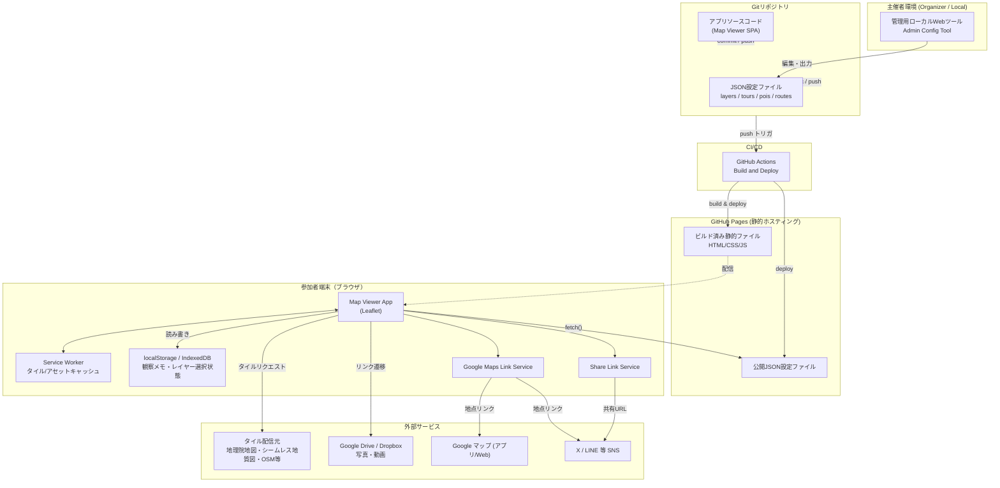

# Design Document

## Overview
本システムは、地理学・地質学の野外教育を支援するスマートフォン向けWebGIS（Leafletベース）であり、Phase 1ではサーバーを持たないGitHub Pages上の静的SPA（Single Page Application）として構築する。レイヤー構成・見学ポイント（POI）・巡検ルート・メディアリンクはリポジトリ内のJSON設定ファイルとして管理し、主催者はローカルの管理用Webツールでこれらを編集してGitにコミット・プッシュすることでサイトへ反映する。GNSS位置表示、オフラインタイルキャッシュ、URL共有、Googleマップ連携リンクなど、参加者側の機能はすべてクライアントサイド（ブラウザ）で完結させ、外部サービス（タイル配信元、Google Drive/Dropbox、Googleマップ、X/LINE）とは疎結合な連携（リンク遷移・fetch）のみを行う。

## Architecture

### High-Level Architecture


### System Components
- **Map Viewer App**: 参加者（学生）がスマートフォンブラウザで利用するメインのSPA。地図表示、GNSS現在地、レイヤー切替、POI/ルート表示、観察メモ、URL共有、Googleマップ連携を担う。
- **Admin Config Tool**: 主催者がレイヤー・POI・ルート・メディアリンクを編集するためのローカル実行Webツール（アプリ本体とは別バンドル）。編集結果はJSONファイルとして出力し、Git操作は主催者自身が行う。
- **Config Repository (JSON)**: レイヤー定義・ツアー（実習）単位のPOI/ルート/メディアリンクを保持するバージョン管理対象のJSONファイル群。
- **Service Worker / Offline Cache**: 閲覧済みタイル・アプリアセットをキャッシュし、圏外時の閲覧継続を支える。
- **Build & Deploy Pipeline (GitHub Actions)**: push時に静的アセットをビルドし、GitHub Pagesへ自動デプロイする。
- **External Integrations**: 地図タイル配信元、Google Drive/Dropbox（メディアリンク）、Googleマップ（地点リンク）、Web Share API経由のSNS連携。

## Components and Interfaces

### Core Interfaces
```typescript
interface LatLng {
  lat: number;
  lng: number;
}

type LayerType = "base" | "overlay";

interface LayerDefinition {
  id: string;                 // レイヤー一意識別子
  name: string;                // 表示名
  type: LayerType;
  urlTemplate: string;         // 例: "https://.../{z}/{x}/{y}.png"
  attribution: string;
  opacity: number;             // 0.0 - 1.0
  minZoom: number;
  maxZoom: number;
  defaultVisible: boolean;
}

type MediaType = "photo" | "video";

interface MediaLink {
  url: string;                 // Google Drive / Dropbox 共有リンク
  caption: string;             // 短い説明文
  type: MediaType;
}

interface ReferencePaper {
  url: string;                 // 公開論文PDFへの外部リンク（DOI/J-STAGE/リポジトリ等）
  citation: string;            // 論文タイトル・出典（著者/発行年等を含む短い引用表記）
}

interface PointOfInterest {
  id: string;
  name: string;
  description: string;         // 短い説明文
  position: LatLng;
  media: MediaLink[];          // Requirement 4.1（写真・動画）
  referencePapers: ReferencePaper[]; // Requirement 4.2（参考論文PDFリンク）
}

interface RoutePath {
  id: string;
  name: string;
  points: LatLng[];            // 線データの頂点列
}

interface TourConfig {
  id: string;                  // 実習（コース・回次）単位の識別子
  title: string;
  description?: string;
  layerIds: string[];          // layers.json 内のLayerDefinition.idを参照
  pois: PointOfInterest[];
  routes: RoutePath[];
}

interface ObservationMemo {
  id: string;
  position: LatLng;
  text: string;
  createdAt: string;           // ISO8601
  updatedAt: string;
}

interface ShareViewState {
  lat: number;
  lng: number;
  zoom: number;
  baseLayerId: string;
  overlayLayerIds: string[];
  poiId?: string;               // 開いていたPOI詳細パネル（任意）
}

interface GoogleMapsLinkParams {
  lat: number;
  lng: number;
}
```

### MapViewer（ルートコンポーネント）
**Responsibilities:**
- Leaflet地図インスタンスの初期化と各サブサービスの統合
- URLクエリ/ハッシュからの初期表示状態（共有ビュー）復元
- 画面レイアウト（レイヤーコントロール、現在地ボタン、共有・Googleマップボタン等）の配置

**Key Methods:**
- `initialize(container: HTMLElement): void`
- `applyShareState(state: ShareViewState): void`
- `getCurrentViewState(): ShareViewState`

### ConfigLoader
**Responsibilities:**
- 実行時に `config/layers.json` および `config/tours/*.json` をfetchし、TourConfig/LayerDefinitionへパースする
- 取得したJSONのスキーマ検証（ConfigValidatorを利用）

**Key Methods:**
- `loadLayers(): Promise<LayerDefinition[]>`
- `loadTour(tourId: string): Promise<TourConfig>`
- `listAvailableTours(): Promise<{ id: string; title: string }[]>`

### ConfigValidator（共有ライブラリ：Admin Tool / Map Viewer 双方で利用）
**Responsibilities:**
- タイルURLテンプレートの形式検証（`{z}/{x}/{y}` プレースホルダの有無等、Requirement 11.4）
- メディアリンクURLの簡易検証（`http(s)://`始まりか、Requirement 4.1.6）
- 参考論文リンクURLの簡易検証（`http(s)://`始まりか、Requirement 4.2.6）
- JSONスキーマ全体の整合性チェック（必須フィールド欠落等）

**Key Methods:**
- `validateLayerDefinition(layer: LayerDefinition): ValidationResult`
- `validateMediaLink(link: MediaLink): ValidationResult`
- `validateReferencePaper(paper: ReferencePaper): ValidationResult`
- `validateTourConfig(tour: TourConfig): ValidationResult`

### LayerManager
**Responsibilities:**
- LayerDefinition一覧からLeafletタイルレイヤーを生成し、ベース/オーバーレイの切替を管理
- 現在の表示レイヤー構成をlocalStorageへ永続化し、再読み込み時に復元（Requirement 2.5）

**Key Methods:**
- `setBaseLayer(layerId: string): void`
- `toggleOverlay(layerId: string, visible: boolean): void`
- `getActiveLayerState(): { baseLayerId: string; overlayLayerIds: string[] }`

### GeolocationService
**Responsibilities:**
- Geolocation APIの`watchPosition`をラップし、現在地・測位精度・方位（DeviceOrientation）をMapViewerへ通知
- 許可拒否・取得失敗時のエラー通知

**Key Methods:**
- `startWatching(onUpdate, onError): void`
- `stopWatching(): void`
- `setFollowMode(enabled: boolean): void`

### OfflineCacheService
**Responsibilities:**
- Service Workerの登録・ライフサイクル管理
- 閲覧済みタイル/アプリアセットのキャッシュ、想定エリアの一括プリキャッシュ（Requirement 3.4）

**Key Methods:**
- `register(): Promise<void>`
- `precacheArea(bounds: LatLngBounds, zoomLevels: number[]): Promise<void>`
- `isTileCached(url: string): Promise<boolean>`

### POIRouteOverlay
**Responsibilities:**
- TourConfig内のPOI・ルートをLeafletマーカー/ポリラインとして描画
- POIタップ時に詳細パネル（名称・説明・メディアリンク一覧・参考論文一覧）を表示。写真/動画（media）と参考論文（referencePapers）は「メディア」「参考文献」のように別セクションで表示し区別する（Requirement 4.2.4）

**Key Methods:**
- `renderTour(tour: TourConfig): void`
- `openPoiDetail(poiId: string): void`
- `closePoiDetail(): void`

### ObservationMemoStore
**Responsibilities:**
- 観察メモのCRUDをlocalStorage/IndexedDBに対して行う（Requirement 5.3）
- メモ一覧のCSV/GeoJSONエクスポート

**Key Methods:**
- `add(memo: Omit<ObservationMemo, "id" | "createdAt" | "updatedAt">): ObservationMemo`
- `update(id: string, text: string): void`
- `delete(id: string): void`
- `list(): ObservationMemo[]`
- `exportAsGeoJson(): string`
- `exportAsCsv(): string`

### ShareLinkService
**Responsibilities:**
- 現在のビュー状態（中心・ズーム・レイヤー構成・任意でPOI ID）をURLへエンコード／URLからデコード
- 不正・破損パラメータ検出時のフォールバック判定（Requirement 13.7）

**Key Methods:**
- `encode(state: ShareViewState): string`（URLを返す）
- `decode(url: string): ShareViewState | null`
- `copyToClipboard(url: string): Promise<boolean>`
- `shareViaWebShareApi(url: string): Promise<boolean>`

### GoogleMapsLinkService
**Responsibilities:**
- 任意地点の緯度経度からGoogleマップのピン留め形式URLを生成（Requirement 14.2）
- クリップボードコピー、非対応環境でのフォールバックUI表示

**Key Methods:**
- `buildSearchUrl(params: GoogleMapsLinkParams): string`
- `copyToClipboard(url: string): Promise<boolean>`

### AdminConfigTool（Layer/POI/Route Editor）
**Responsibilities:**
- レイヤー・POI・ルート・メディアリンクのフォーム編集、ConfigValidatorによる検証、地図プレビュー（Requirement 11.5）
- 編集結果のJSONファイル出力（ダウンロードまたはローカルファイル書き込み）

**Key Methods:**
- `loadExistingConfig(source: File | string): Promise<TourConfig | LayerDefinition[]>`
- `previewOnMap(config: TourConfig | LayerDefinition[]): void`
- `exportJson(config: TourConfig | LayerDefinition[]): Blob`

## Data Models

### Database Schema
Phase 1では下記のスキーマを実データベースとしては用いず、後述の「File Storage Structure」で示すJSON設定ファイルとブラウザのlocalStorage/IndexedDBによりデータを永続化する。以下は、Requirement 5・7・8で言及されている**将来のサーバーサイド機能（Phase 2以降）**を見据え、同一のインターフェース定義から導出したデータベーススキーマである。

```sql
CREATE TABLE organizers (
    id UUID PRIMARY KEY DEFAULT gen_random_uuid(),
    email TEXT UNIQUE NOT NULL,
    password_hash TEXT NOT NULL,
    created_at TIMESTAMPTZ NOT NULL DEFAULT now()
);

CREATE TABLE tours (
    id UUID PRIMARY KEY DEFAULT gen_random_uuid(),
    organizer_id UUID NOT NULL REFERENCES organizers(id),
    title TEXT NOT NULL,
    description TEXT,
    layer_ids TEXT[] NOT NULL DEFAULT '{}',
    created_at TIMESTAMPTZ NOT NULL DEFAULT now(),
    updated_at TIMESTAMPTZ NOT NULL DEFAULT now()
);

CREATE TABLE layers (
    id UUID PRIMARY KEY DEFAULT gen_random_uuid(),
    organizer_id UUID NOT NULL REFERENCES organizers(id),
    name TEXT NOT NULL,
    type TEXT NOT NULL CHECK (type IN ('base', 'overlay')),
    url_template TEXT NOT NULL,
    attribution TEXT NOT NULL,
    opacity NUMERIC(3,2) NOT NULL DEFAULT 1.0,
    min_zoom INTEGER NOT NULL DEFAULT 0,
    max_zoom INTEGER NOT NULL DEFAULT 18,
    default_visible BOOLEAN NOT NULL DEFAULT false,
    created_at TIMESTAMPTZ NOT NULL DEFAULT now()
);

CREATE TABLE points_of_interest (
    id UUID PRIMARY KEY DEFAULT gen_random_uuid(),
    tour_id UUID NOT NULL REFERENCES tours(id) ON DELETE CASCADE,
    name TEXT NOT NULL,
    description TEXT NOT NULL,
    position JSONB NOT NULL, -- { "lat": number, "lng": number }
    created_at TIMESTAMPTZ NOT NULL DEFAULT now()
);

CREATE TABLE media_links (
    id UUID PRIMARY KEY DEFAULT gen_random_uuid(),
    poi_id UUID NOT NULL REFERENCES points_of_interest(id) ON DELETE CASCADE,
    url TEXT NOT NULL,
    caption TEXT NOT NULL,
    media_type TEXT NOT NULL CHECK (media_type IN ('photo', 'video')),
    created_at TIMESTAMPTZ NOT NULL DEFAULT now()
);

CREATE TABLE reference_papers (
    id UUID PRIMARY KEY DEFAULT gen_random_uuid(),
    poi_id UUID NOT NULL REFERENCES points_of_interest(id) ON DELETE CASCADE,
    url TEXT NOT NULL,
    citation TEXT NOT NULL,
    created_at TIMESTAMPTZ NOT NULL DEFAULT now()
);

CREATE TABLE routes (
    id UUID PRIMARY KEY DEFAULT gen_random_uuid(),
    tour_id UUID NOT NULL REFERENCES tours(id) ON DELETE CASCADE,
    name TEXT NOT NULL,
    points JSONB NOT NULL -- LatLng[]
);

CREATE TABLE observation_memos (
    id UUID PRIMARY KEY DEFAULT gen_random_uuid(),
    tour_id UUID NOT NULL REFERENCES tours(id),
    participant_session_id UUID NOT NULL, -- 匿名セッションID（アカウント不要を想定）
    position JSONB NOT NULL,
    text TEXT NOT NULL,
    created_at TIMESTAMPTZ NOT NULL DEFAULT now(),
    updated_at TIMESTAMPTZ NOT NULL DEFAULT now()
);
```

### File Storage Structure
Phase 1（GitHub Pages静的運用）における実際のデータ永続化はリポジトリ内のJSONファイル群で行う。

```
repo-root/
├── .github/
│   └── workflows/
│       └── deploy.yml            # push時にビルド・GitHub Pagesへデプロイ
├── admin-tool/                    # 主催者向けローカル管理Webツールのソース
│   └── src/
├── src/                            # Map Viewer SPA（参加者向け）のソース
│   ├── components/
│   ├── services/                  # LayerManager, GeolocationService, ShareLinkService 等
│   └── main.ts
├── public/
│   ├── index.html
│   ├── config/
│   │   ├── layers.json            # 全レイヤー定義（LayerDefinition[]）
│   │   └── tours/
│   │       ├── 2026-spring-geology.json   # TourConfig（POI/ルート/メディアリンク含む）
│   │       └── 2026-summer-fieldcamp.json
│   └── icons/                     # PWAアイコン等
└── dist/                           # ビルド出力（GitHub Pagesへデプロイされる静的ファイル）
```

### Configuration File Schemas（JSON）
`public/config/layers.json`:
```json
[
  {
    "id": "gsi-std",
    "name": "地理院地図（標準）",
    "type": "base",
    "urlTemplate": "https://cyberjapandata.gsi.go.jp/xyz/std/{z}/{x}/{y}.png",
    "attribution": "国土地理院",
    "opacity": 1.0,
    "minZoom": 2,
    "maxZoom": 18,
    "defaultVisible": true
  },
  {
    "id": "aist-geology",
    "name": "シームレス地質図",
    "type": "overlay",
    "urlTemplate": "https://gbank.gsj.jp/seamless/v2/api/1.3/tiles/{z}/{y}/{x}.png",
    "attribution": "産総研 地質調査総合センター",
    "opacity": 0.6,
    "minZoom": 2,
    "maxZoom": 16,
    "defaultVisible": false
  }
]
```

`public/config/tours/2026-spring-geology.json`（`TourConfig`に対応。POI・ルート・メディアリンクを1ファイルに集約し、実習単位でのファイル分割・再利用を実現、Requirement 4.5）:
```json
{
  "id": "2026-spring-geology",
  "title": "2026年度春季 地質巡検",
  "layerIds": ["gsi-std", "aist-geology"],
  "pois": [
    {
      "id": "poi-01",
      "name": "露頭A（花崗岩貫入部）",
      "description": "花崗岩の貫入と接触変成の様子が観察できる露頭。",
      "position": { "lat": 35.681, "lng": 139.767 },
      "media": [
        {
          "url": "https://drive.google.com/file/d/xxxx/view",
          "caption": "露頭全景写真（2025年撮影）",
          "type": "photo"
        }
      ],
      "referencePapers": [
        {
          "url": "https://doi.org/10.xxxx/example.2020.001",
          "citation": "山田太郎ほか (2020)「〇〇地域における花崗岩の貫入年代」地質学雑誌"
        }
      ]
    }
  ],
  "routes": [
    {
      "id": "route-01",
      "name": "駐車場〜露頭Aルート",
      "points": [
        { "lat": 35.680, "lng": 139.766 },
        { "lat": 35.681, "lng": 139.767 }
      ]
    }
  ]
}
```

## Error Handling
- **GNSS取得失敗/許可拒否（Requirement 1.4）**: エラーメッセージをトースト表示し、地図の閲覧・レイヤー操作は継続可能とする。現在地マーカーは非表示のままとする。
- **タイル取得失敗（オフライン/未キャッシュ、Requirement 3.3）**: 個別タイルのみグレーアウト代替表示とし、アプリ全体はクラッシュさせない。Service Workerキャッシュにフォールバックし、キャッシュも無い場合はプレースホルダタイルを表示する。
- **設定JSON読み込み失敗・スキーマ不正（Requirement 10, 11.4）**: `ConfigValidator`で検知し、コンソール警告に加えユーザー向けに軽量な通知を表示する。読み込み失敗したレイヤー/POIのみ除外し、他の正常な設定は表示を継続する。
- **メディアリンク切れ（Requirement 4.1.5）/ 参考論文リンク切れ（Requirement 4.2.5）**: リンクをタップした結果はブラウザ/OS側のエラーに委ね、アプリ側のPOI詳細表示自体には影響を与えない。リンクURLの形式不正はビルド時/ロード時の警告に留める。
- **共有URLパラメータ不正（Requirement 13.7）**: `ShareLinkService.decode()`が`null`を返した場合、MapViewerはエラー画面を出さずデフォルトビュー（初期表示位置・初期レイヤー構成）にフォールバックする。
- **クリップボードAPI非対応（Requirement 14.6）**: `navigator.clipboard`が利用不可の場合、生成したURLをテキストとして選択可能な入力欄に表示し、手動コピーを促す。
- **Service Worker登録失敗**: キャッシュ機能なしで通常のネットワーク経由動作にフォールバックし、アプリの起動自体は継続する。
- **外部タイル配信元の一時的エラー（5xx等）**: 一定回数リトライ後、該当ベースレイヤーが利用不可である旨をユーザーに通知し、他のベースレイヤーへの切替を促す。

## Testing Strategy
- **単体テスト**（Vitest等）:
  - `ShareLinkService`: `encode`/`decode`の往復一致、不正パラメータ時の`null`返却
  - `GoogleMapsLinkService`: URL生成フォーマットの正当性
  - `ConfigValidator`: タイルURLテンプレート検証、メディアリンク検証の正常系・異常系
  - `ObservationMemoStore`: CRUD操作、CSV/GeoJSONエクスポート内容の妥当性
  - `LayerManager`: レイヤー切替状態のlocalStorage永続化・復元
- **結合テスト**（Playwright等、モックGeolocation/モックfetchを利用）:
  - レイヤーコントロール操作によるベース/オーバーレイ切替とページ再読み込み後の状態復元（Requirement 2.5）
  - POIタップ→詳細パネル表示→メディアリンク一覧表示のフロー
  - 共有URLアクセス時のビュー状態（中心・ズーム・レイヤー・POI）再現の一致確認
  - オフライン状態シミュレーション時のタイル代替表示・アプリ非クラッシュ確認
- **パフォーマンステスト**:
  - Lighthouse CIによる初回表示速度（3秒以内、Requirement 7.1）の継続的計測
  - 大量POI（100件超）・複数オーバーレイレイヤー同時表示時の描画パフォーマンス計測
- **CI**（GitHub Actions）:
  - push時にlint・型チェック・単体テスト・ビルドを実行し、失敗時はGitHub Pagesへのデプロイをブロックする（Requirement 9.3, 12.3）
